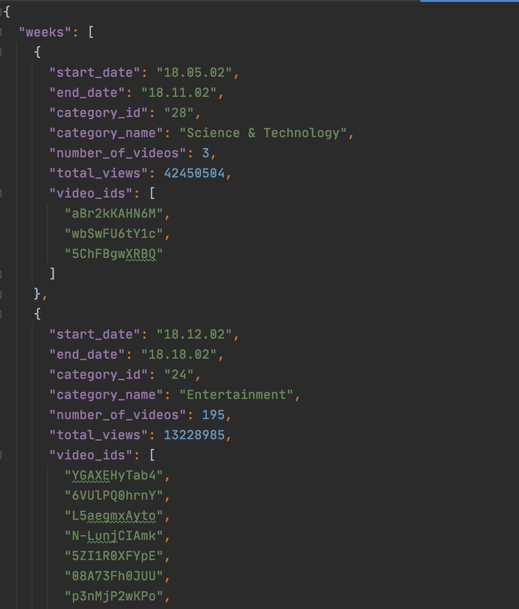
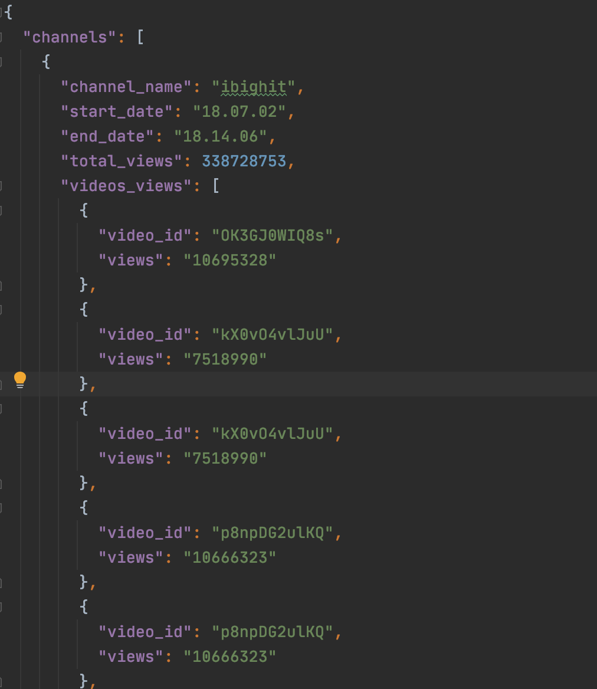
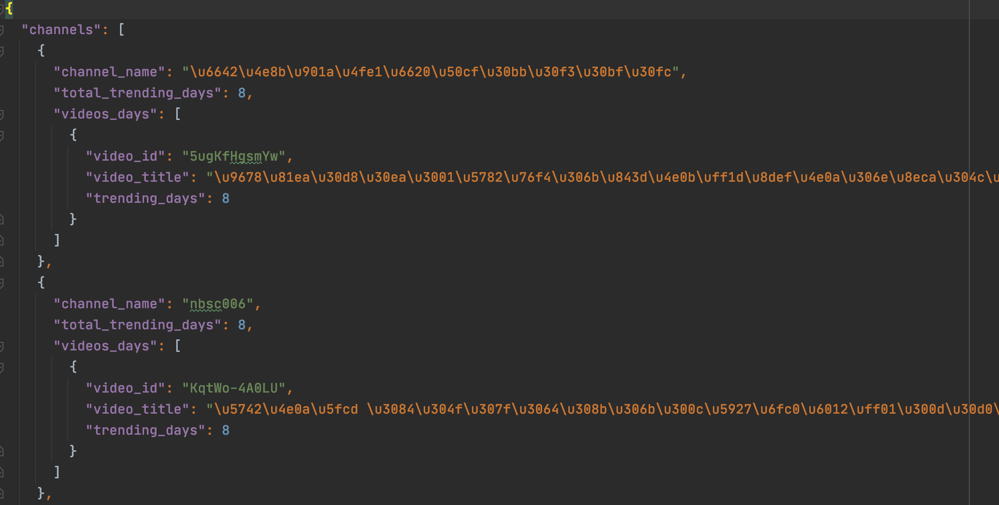
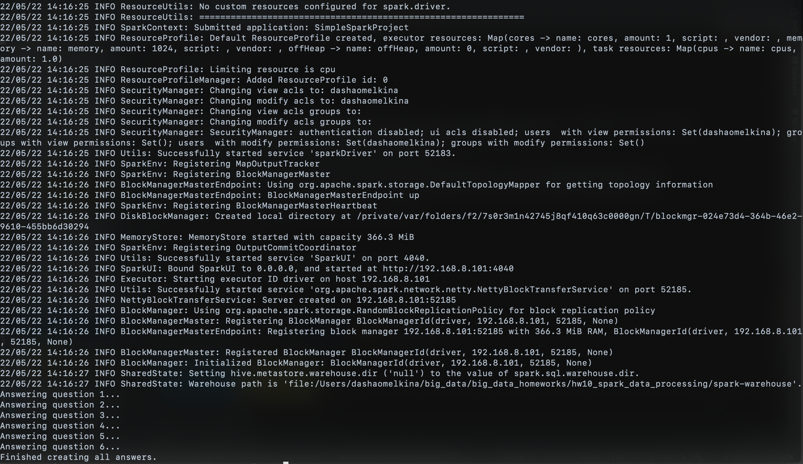

## HW 10: Data processing with Spark

Spark installation:
```
docker-compose up -d
```

For data processing I chose videos and categories for Japan (files JP_category_id.json and JPvideos.csv accordingly).
Data must be in a directory called "japan_data", with parent directory being this one 
(**big_data_homeworks/hw10_spark_data_processing/japan_data**). 

P.S. In the files which I tested there were some problems with video ids –– a lot of them were not ids at all. 
I also decided to drop all the videos with "null" titles, because there records were mostly completely empty.

Read data using Spark and answer questions from the task:
```
bash process_using_spark.sh
```

To shutdown cluster and remove containers and network:
```
docker-compose down
```

Json files with results are in [results/](results) directory.

Results examples:




Working code example:


