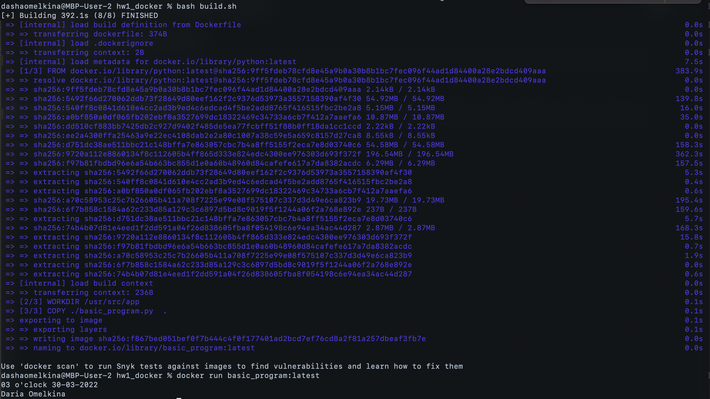

### Homework 1: Docker basics
Running a basic program in a docker container.

## Usage:
To build docker container enter:
```
bash build.sh
```

To run docker container enter:
```
docker run basic_program:latest
```

*Run result example:*

