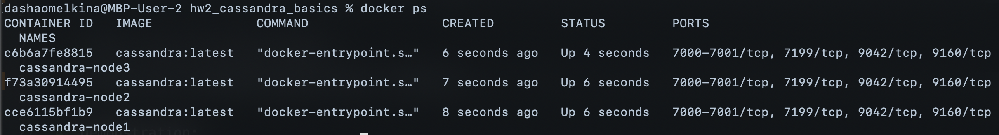
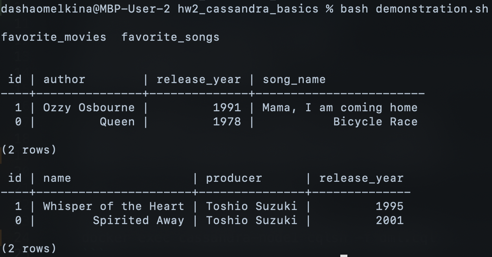

# Homework 2: Cassandra basics
Setting up and running Cassandra.

## Tasks:
1. Running 3 Cassandra nodes in detached mode in one network:
    ```
    bash run-cluster.sh
    ```
    Demonstration:
    

    Shutting down Cassandra cluster:
    ```
    bash shutdown-cluster.sh
    ```

2. Create keyspace and two tables in the cluster by running cql script:
    ```
    docker exec cassandra-node1 cqlsh -f ddl.cql
    ```

3. Insert rows into these tables by running cql script:
    ```
    docker exec cassandra-node1 cqlsh -f dml.cql
    ```

4. Demonstration:
    ```
    bash demonstration.sh
    ```
    Results:
    


P. S. If there is a problem that containers exit with code 137, it might mean that docker doesn't have enough RAM. It happened in my case. Fix from stackoverflow: Docker Desktop app > Preferences > Resources > Advanced and increase the MEMORY 
