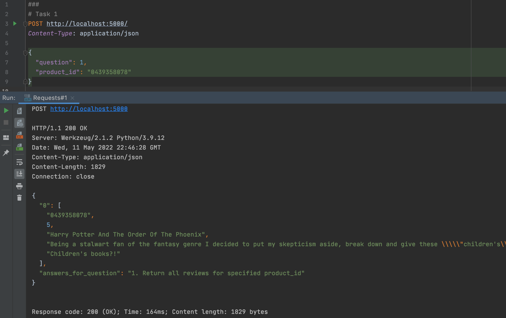
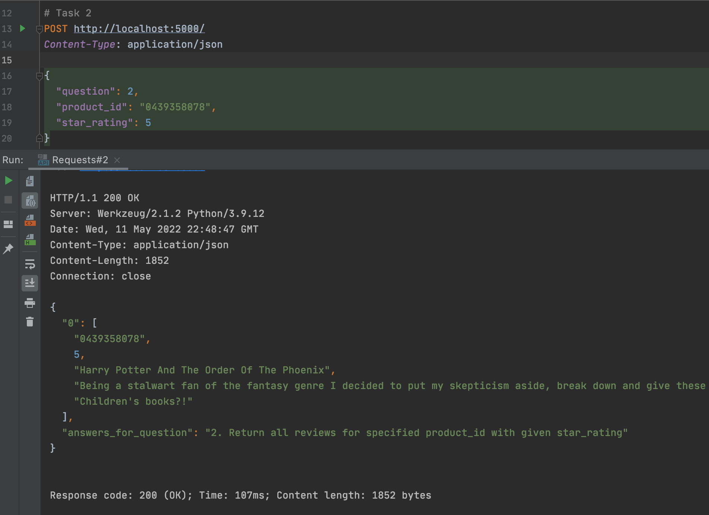
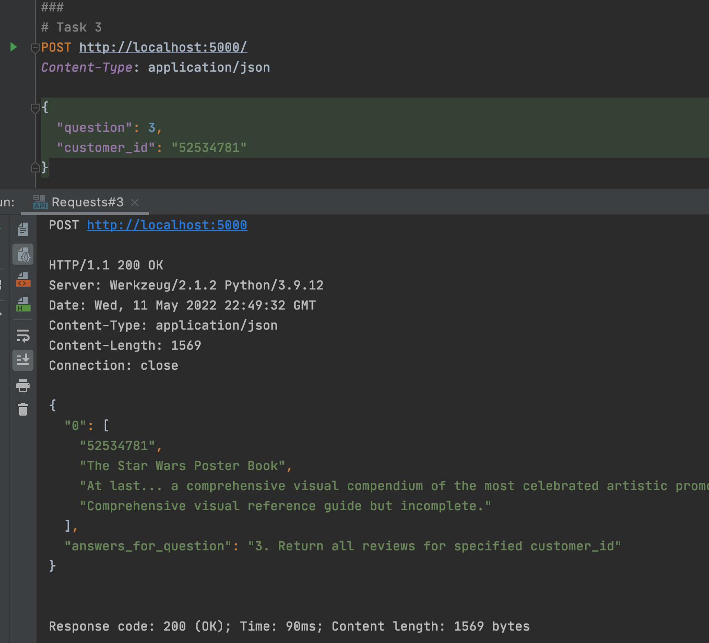
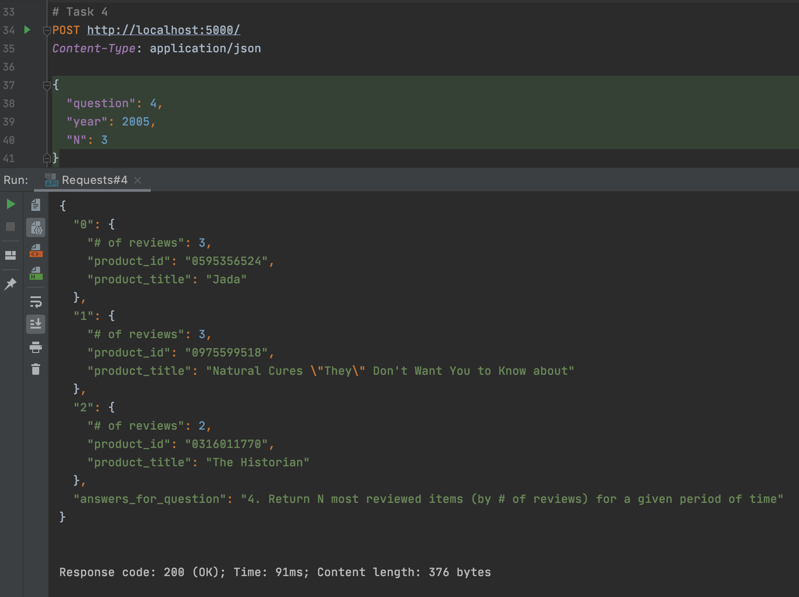
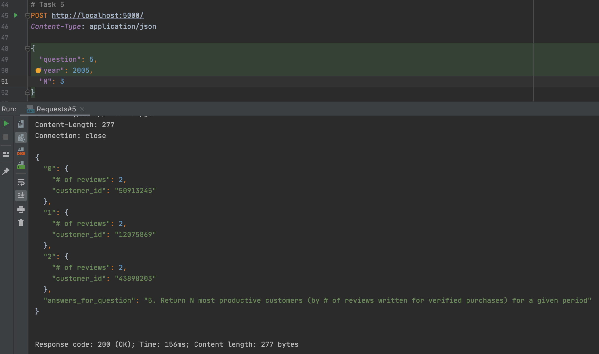
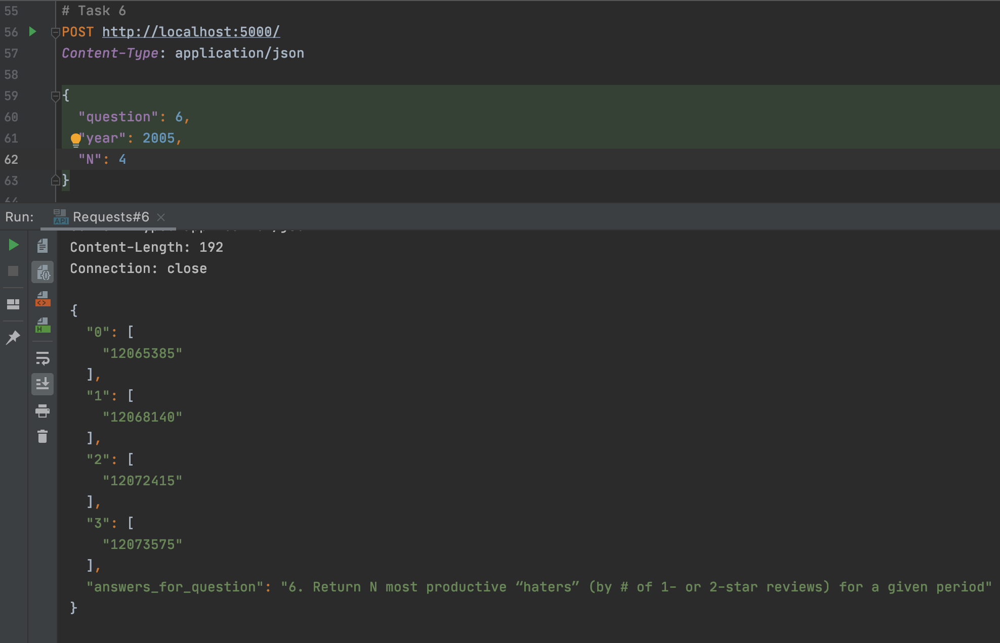
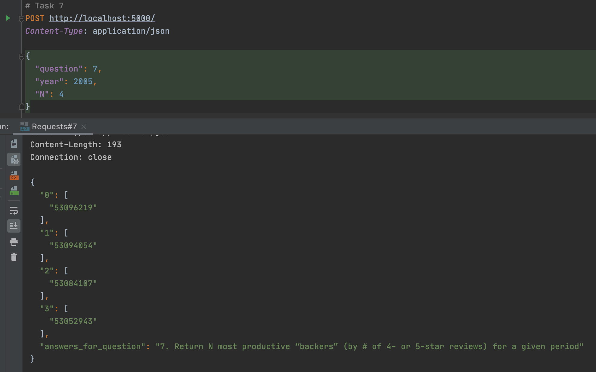

# HW 4: Cassandra code interaction

## Run example:
Launch one-node Cassandra, create tables and write data into it (path to data file is hardcoded in [py_scripts/write_to_cassandra.py](py_scripts/write_to_cassandra.py)):
```
bash sh_scripts/launch_cassandra.sh
bash sh_scripts/create_tables.sh
bash sh_scripts/write_to_cassandra.sh
```
P.S. after launching we need to wait a couple of minutes, before proceeding to table creation. 

Read from Cassandra to answer the questions from task (for some tasks (1, 2, 3, 6, 7) answers are got only with cql queries, for other (4 and 5) 
–– they are additionally processed by python (namely with pandas) code to get the final answer (i am not sure if this is legal or not)):
```
bash sh_scripts/read_from_cassandra.sh
```

Results example (i accidentally forgot to change port to 8080 from 5000 in these examples, but in final version port is 8080) 
with requests from [Requests.http](Requests.http) file:








Finally shutdown Cassandra:
```
bash sh_scripts/shutdown_cassandra.sh
```

