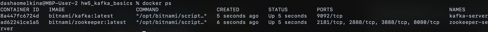
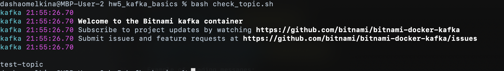
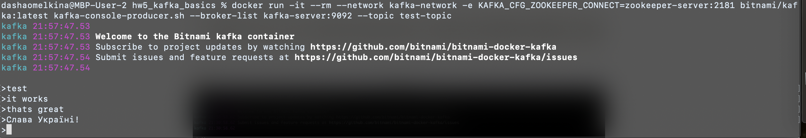
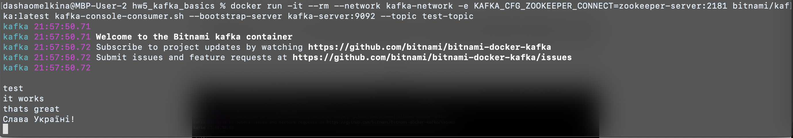

# HW 5: Kafka basics

To create Kafka cluster:
```
bash run-cluster.sh
```
Installation result:


Create topic test-topic:
```
bash create_topic.sh
```
Topic creation check:
```
bash check_topic.sh
```


Example of writing messages:


Example of reading messages:



To shutdown Kafka cluster:
```
bash shutdown-cluster.sh
```