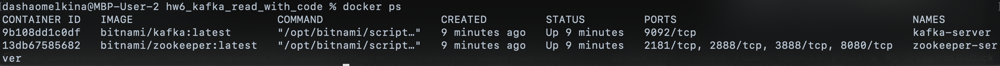
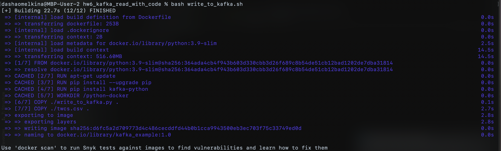

## HW 6: Kafka read with code

Create Kafka installation:
```
bash run-cluster.sh
```

Installation result:


Write tweets from file into Kafka (path to csv file is hardcoded in [write_to_kafka.py](write_to_kafka.py)):
```
bash write_to_kafka.sh
```
Script run results:


Reading data using console client (running in separate terminal during writing process):
```
bash console_read.sh
```
Reading result:


To shutdown Kafka cluster:
```
bash shutdown-cluster.sh
```