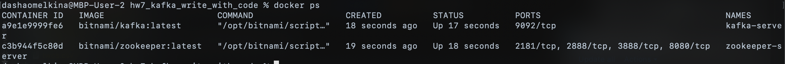
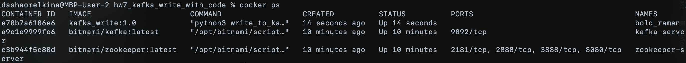
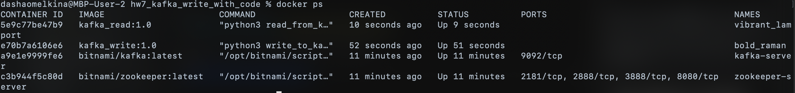
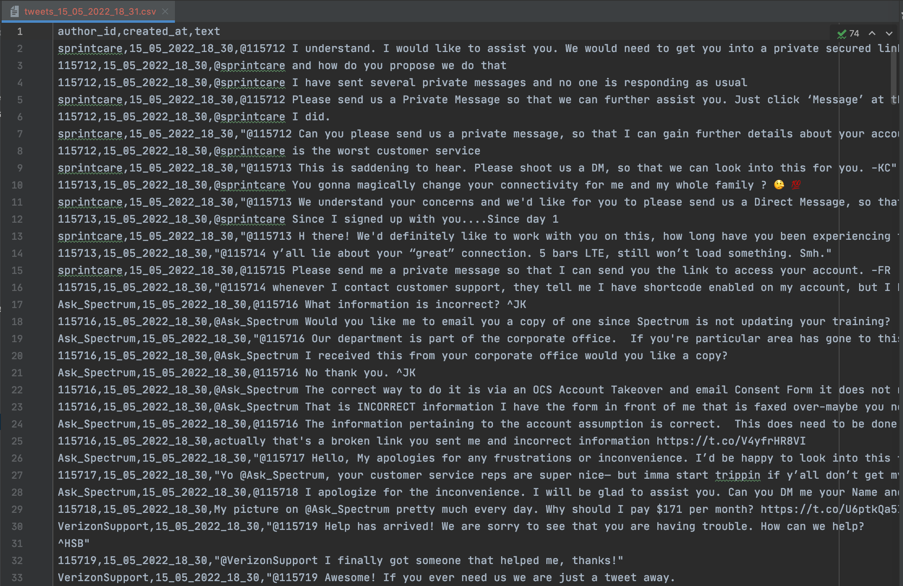

## HW 7: Kafka write with code

Create Kafka installation:
```
bash run-cluster.sh
```

Installation result:


Write tweets from file into Kafka (path to csv file is hardcoded in [write_to_kafka.py](write_to_kafka.py)):
```
bash write/write_to_kafka.sh
```
Script run results:


Reading data (in a second terminal instance):
```
bash read/read_from_kafka.sh
```
Script run results:


Reading results:


Files with example results are in [results/](results) directory. In order to write them directly into host, 
I had to pass absolute path to results directory in [read/read_from_kafka.sh](read/read_from_kafka.sh).

File screenshot example:


To shutdown Kafka cluster:
```
bash shutdown-cluster.sh
```