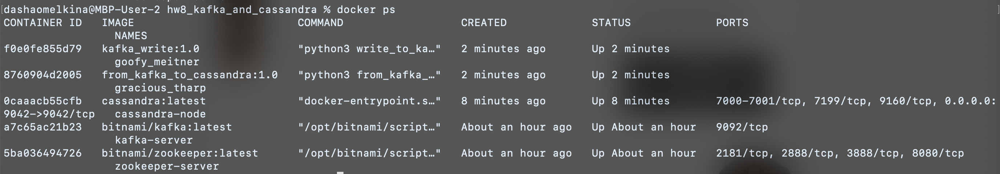
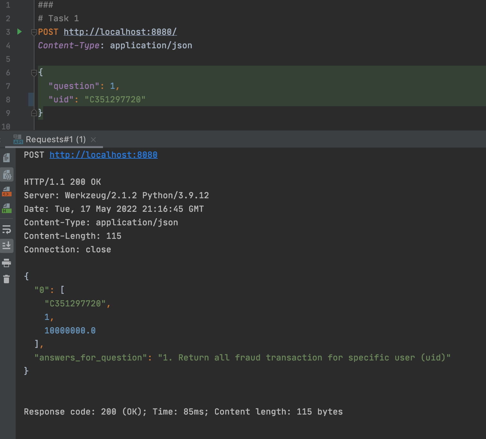
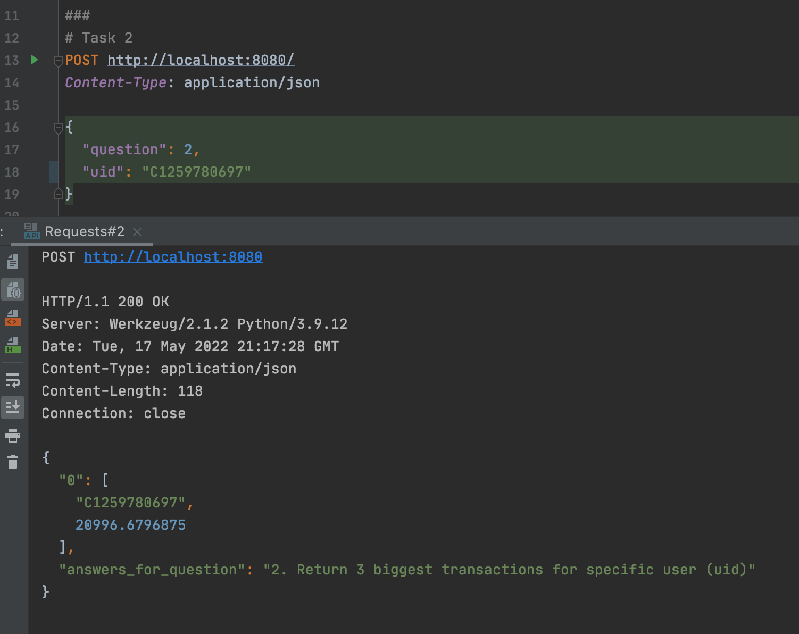
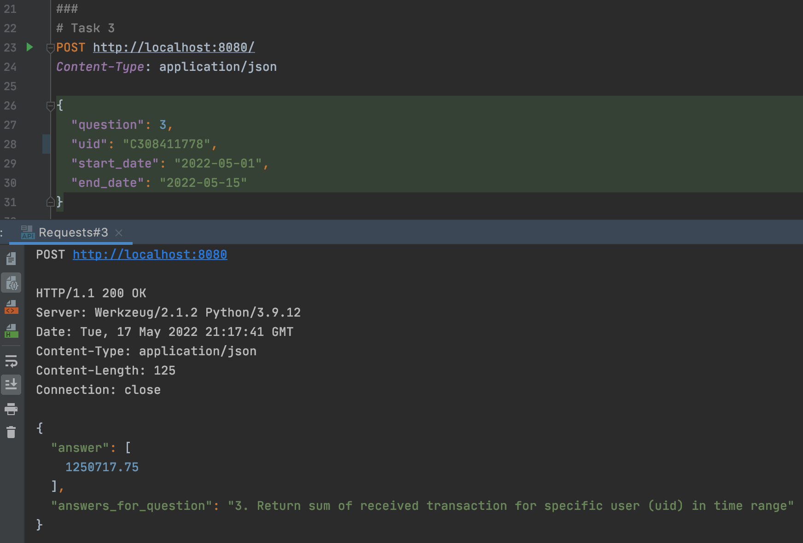

## HW 8: Kafka and Cassandra communication through code
Create Kafka and Cassandra clusters in one network:
```
bash kafka_part/run-kafka-cluster.sh
bash cassandra_part/run-cassandra-cluster.sh
```
P.S. Cassandra installation takes more than a minute to be sure that we can connect to server to create keyspace.

Write messages about transaction frauds into Kafka topic called "frauds" 
(path to file with transactions is hardcoded in [kafka_part/write_to_kafka.py](kafka_part/write_to_kafka.py) file):
```
bash kafka_part/write_to_kafka.sh
```

At the same time (in a different terminal instance) run code, 
which reads from Kafka and writes into Cassandra:
```
bash from_kafka_to_cassandra.sh
```

To run app with rest api:
```
bash rest_api/app.sh
```
Chain producer-Kafka-consumer as presented in docker ps:


Examples of http queries in [rest_api/Requests.http](rest_api/Requests.http).

Queries results example (after 90 minutes of chain work):




To shutdown both Kafka and Cassandra clusters:
```
bash shutdown-cluster.sh
```

P.S. Here are commands for manual checks of data in Kafka and Cassandra:
```
docker run -it --rm --network kafka-cassandra-network -e KAFKA_CFG_ZOOKEEPER_CONNECT=zookeeper-server:2181 bitnami/kafka:latest kafka-console-consumer.sh --bootstrap-server kafka-server:9092 --topic frauds
docker run -it --network kafka-cassandra-network --rm cassandra cqlsh cassandra-node
```