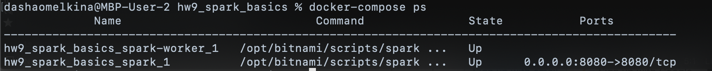
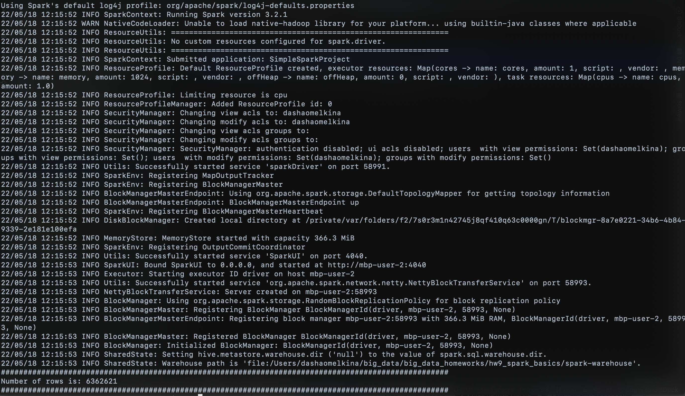

## HW 9: Spark basics

Spark installation:
```
docker-compose up -d
```

Result of installation:


Read data using Spark and print number of rows (file PS_20174392719_1491204439457_log.csv should be in this directory):
```
bash read_using_spark.sh
```

Results example:


To shutdown cluster and remove containers and network:
```
docker-compose down
```